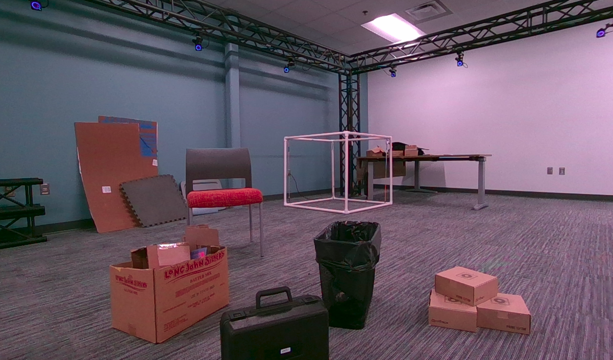
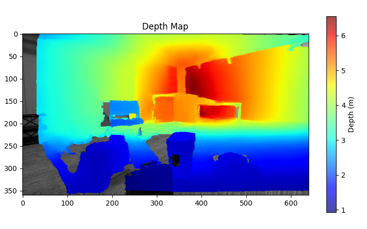
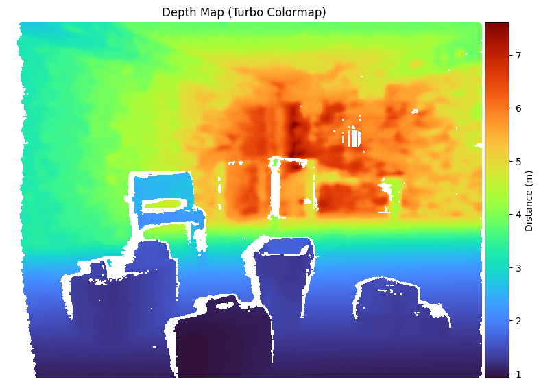
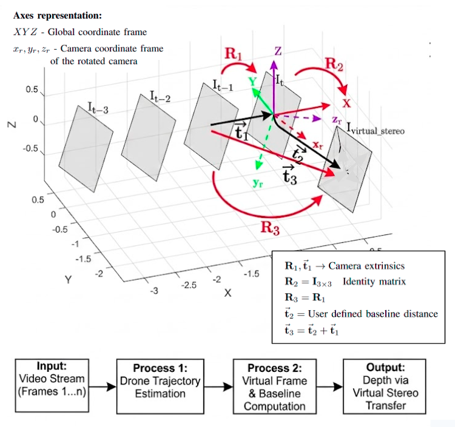

# EpiTransfer

Monocular depth estimation from a moving RealSense camera using epipolar transfer, validated against LIDAR ground truth.

Given two RGB frames from known camera poses, EpiTransfer computes dense correspondences with [RAFT](https://github.com/princeton-vl/RAFT) optical flow, filters them with fundamental-matrix RANSAC, derives the epipolar geometry from the relative camera pose, synthesize a virtual stereo frame and use stereo depth theory to find per-pixel depth. 

<table>
  <tr>
    <td align="center">
      
      <br />
      <b>Original Image</b>
    </td>
    <td align="center">
      
      <br />
      <b>Estimated Depth using EpiTransfer</b>
    </td>
    <td align="center">
      
      <br />
      <b>RGB-D depth</b>
    </td>
  </tr>
</table>

## Pipeline

<p align="center">
  
  <br />
  <b>Original Image</b>
</p>

1. **Undistort** raw RealSense color frames using the calibrated intrinsics (`undiistorted_images.py`).
2. **Estimate depth** between a previous and current frame (`depth_est_quat_withlidar.py`):
   - Load camera poses (quaternion + position) from mocap CSVs and average them per frame.
   - Compute dense RAFT correspondences between the frame pair, with a tunable forward-backward consistency check.
   - Filter matches using fundamental-matrix RANSAC.
   - Build the fundamental matrix from the relative pose and camera intrinsics, compute epilines, and triangulate depth from disparity.
   - Project LIDAR points into the same image and compare against estimated depth (percent error, per-point plots).
3. **Visualize** raw depth maps captured by the sensor for inspection (`visualize_depth.py`).


## Requirements

- Python 3
- `numpy`, `pandas`, `opencv-python`, `matplotlib`, `pyyaml`, `torch`
- [RAFT](https://github.com/princeton-vl/RAFT) (checked out locally; the path is currently added via `sys.path.append` in `depth_est_quat_withlidar.py` — update this to point at your own RAFT checkout)
- A pretrained RAFT model checkpoint

## Usage

Undistort captured frames:

```bash
python undiistorted_images.py
```

Run depth estimation with LIDAR comparison:

```bash
python depth_est_quat_withlidar.py
```

Visualize a raw depth/color pair:

```bash
python visualize_depth.py
```

> Note: file paths (image directories, model checkpoints, RAFT location) are currently hardcoded at the top of each script — update them for your own data layout before running.


